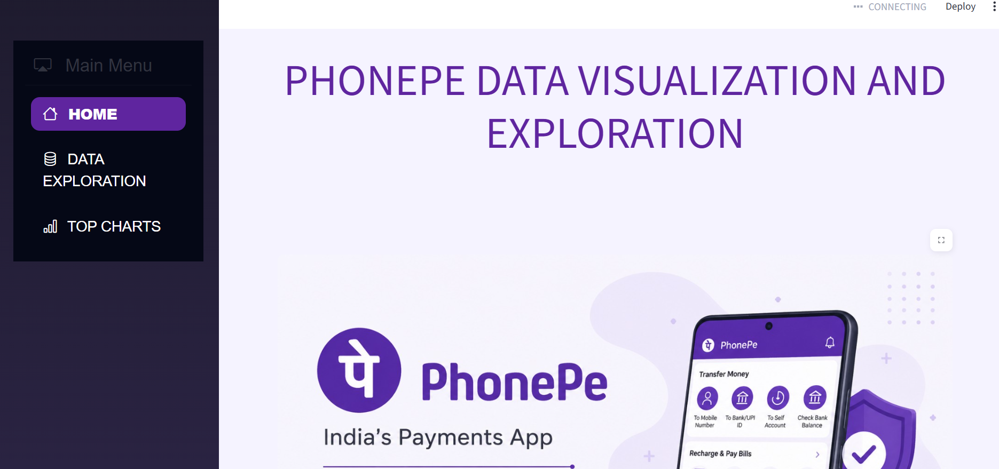
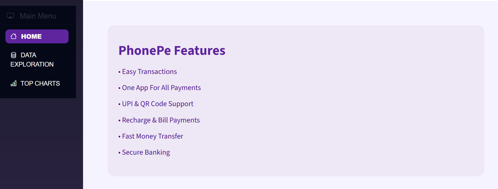
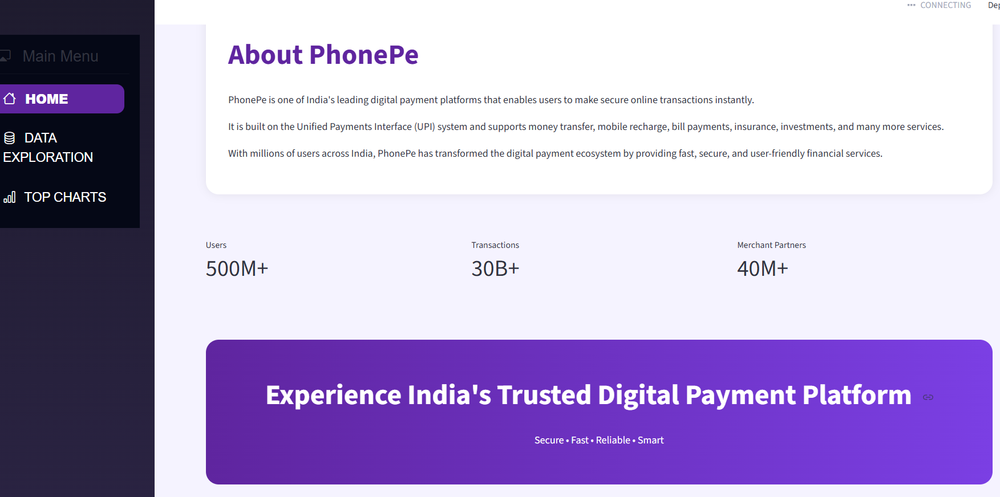

**PhonePe Data Visualization and Exploration

A data analytics and visualization project built using Python, SQL, Streamlit, Plotly, and Pandas to analyze PhonePe Pulse transaction data across India.

**The project provides interactive dashboards for:
1.Transaction Analysis
2.User Analysis
3.Insurance Analysis
4.State-wise Insights
5.Top Charts and Trends

**Technologies Used
Python
Streamlit
PostgreSQL
Pandas
Plotly
Git and GitHub

**Features
Interactive Dashboard
State-wise Transaction Analysis
Insurance Transaction Insights
User Registration Analysis
Top Performing States and Districts
Dynamic Charts and Visualizations
PhonePe Inspired UI Design

**Dataset
This project uses the PhonePe Pulse dataset provided by PhonePe for data exploration and analytics purposes.

**Dashboard Sections
Home
PhonePe overview
Features and introduction section
Data Exploration
Transaction amount analysis
Insurance insights
User analysis
Top Charts
Top states by transaction amount
Top districts by registered users
Insurance trends

# PhonePe Data Visualization and Exploration

A data analytics and visualization project built using Python, SQL, Streamlit, Plotly, and Pandas to analyze PhonePe Pulse transaction data across India.

## The project provides interactive dashboards for:

1. Transaction Analysis  
2. User Analysis  
3. Insurance Analysis  
4. State-wise Insights  
5. Top Charts and Trends  

---

## Technologies Used

- Python  
- Streamlit  
- PostgreSQL  
- Pandas  
- Plotly  
- Git and GitHub  

---

## Features

- Interactive Dashboard  
- State-wise Transaction Analysis  
- Insurance Transaction Insights  
- User Registration Analysis  
- Top Performing States and Districts  
- Dynamic Charts and Visualizations  
- PhonePe Inspired UI Design  

---

## Dataset

This project uses the PhonePe Pulse dataset provided by PhonePe for data exploration and analytics purposes.

---

## Dashboard Sections

### Home
- PhonePe overview  
- Features and introduction section  

### Data Exploration
- Transaction amount analysis  
- Insurance insights  
- User analysis  

### Top Charts
- Top states by transaction amount  
- Top districts by registered users  
- Insurance trends  

---

# Screenshots

## Home Page

---

## Features Section

---

## About Section

---

## Run Project

pip install -r requirements.txt
streamlit run phonepe.py

**Conclusion
This project demonstrates how digital payment data can be analyzed using Python and SQL to generate meaningful business insights through interactive visual dashboards.

**Developed By
Bhavya Davane
